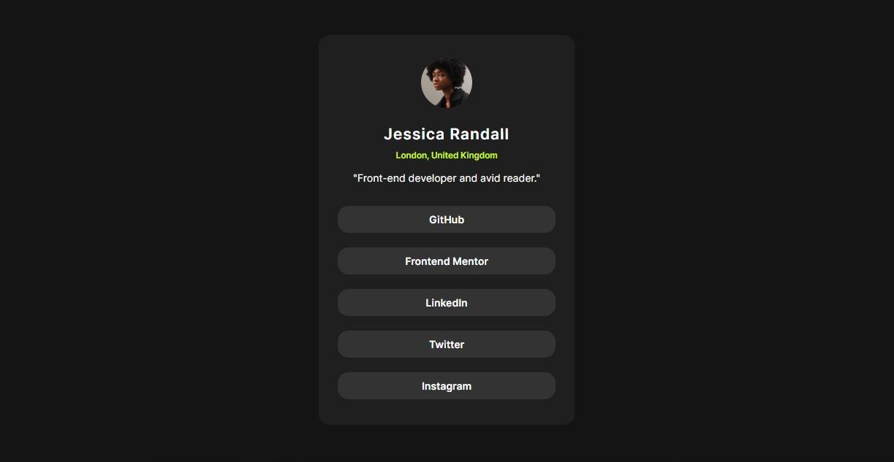

# Frontend Mentor - Social links profile solution

This is a solution to the [Social links profile challenge on Frontend Mentor](https://www.frontendmentor.io/challenges/social-links-profile-UG32l9m6dQ). Frontend Mentor challenges help you improve your coding skills by building realistic projects. 

## Table of contents

- [Overview](#overview)
  - [The challenge](#the-challenge)
  - [Screenshot](#screenshot)
  - [Links](#links)
- [My process](#my-process)
  - [Built with](#built-with)
  - [What I learned](#what-i-learned)
  - [Continued development](#continued-development)

## Overview

### The challenge

Users should be able to:

- See hover and focus states for all interactive elements on the page

### Screenshot

### Links

- Solution URL: [https://github.com/acoderlooksat50/frontendmentor_social_card](https://github.com/acoderlooksat50/frontendmentor_social_card)
- Live Site URL: [https://acoderlooksat50.github.io/frontendmentor_social_card](https://acoderlooksat50.github.io/frontendmentor_social_card)

## My process

### Built with

- Semantic HTML5 markup
- CSS custom properties
- Flexbox

### What I learned

This project was mostly review of the elements of the qr and blog card projects.  I enjoyed making it.  Styling the anchor tag is a new element for these projects.  When I started thinking about the HTML I wondered if the social links were buttons or links.  I decided they should be links because buttons should be for some type of action, usually with a form.  The anchor tag is going to be a link to another location.  

The grey on grey color scheme seems problematic to me.  Not much contrast there, but the hover effect has great contrast.

### Continued development

Based on completing this project, I will look to continue developing in the following areas:
-Semantic HTML
-Accessibility

